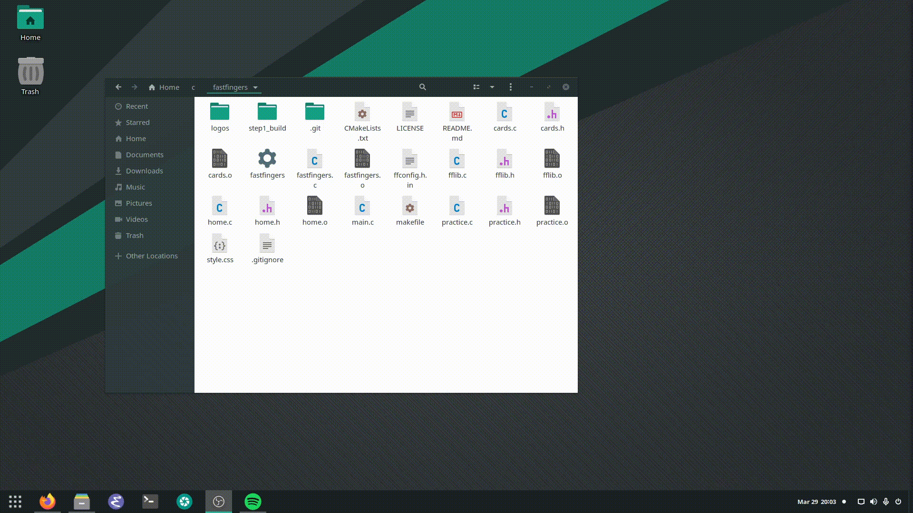

# FastFingers App

FastFingers is an open-source application that helps its users to remove the habit of using a mouse, by helping them to memorize the shortcuts they want to learn.

## Dependencies
**GTK 4**   
  * **Arch:** gtk4
  * **Debian/Ubuntu:** libgtk-4-1, libgtk-4-dev (for development)
  * **Fedora:** gtk4, gtk4-devel (for development)


## Installation

Download the source code and move to the source directory

```bash
git clone https://github.com/aliereny/fastfingers.git
cd fastfingers
```
Create the build directory and move to it

```bash
mkdir build
cd build
```

Generate the binary files by CMake CLI

```bash
cmake ..
cmake --build .
```
It is ready to run
```bash
./ff_app
```



## Contributing
Pull requests are welcome. For major changes, please open an issue first to discuss what you would like to change.

Please make sure to update tests as appropriate.

## License
[MIT](https://choosealicense.com/licenses/mit/)
